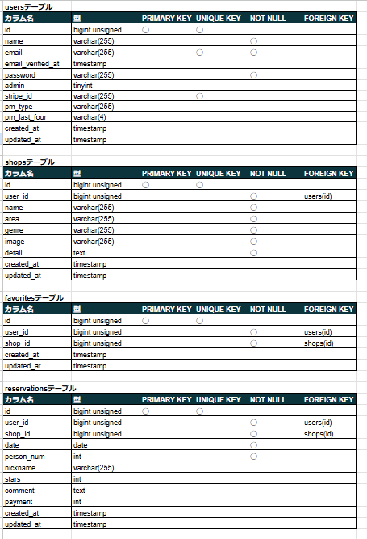
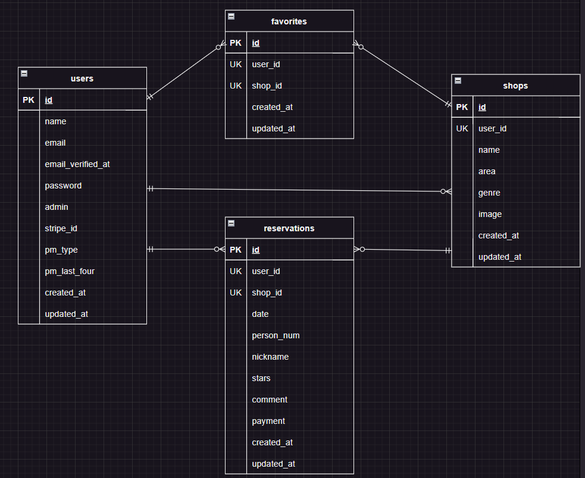

# Rese(リーズ)

飲食店予約アプリ


## 作成した目的

外部の飲食店予約サービスは手数料を取られるので自社で予約サービスを持ちたい。

## アプリケーション URL

- 開発環境:http://localhost/
- phpMyAdmin:http://localhost:8080/
- mailhog:http://localhost:8025/
- Stripe:https://stripe.com/jp

会員登録のパスワードは 8 文字以上で登録してください。

## 機能一覧

1. メール認証機能
2. 飲食店お気に入り機能
3. 飲食店予約登録・変更・削除
4. 飲食店検索機能
5. レビュー登録
6. 画像のストレージ保存
7. 予約のリマインダー送信
8. 全利用者へメール送信
9. QR コード発行
10. Stripe を利用した決済機能

## 使用技術（実行環境）

- php 8.3.2
- Laravel 8.83.27
- MySQL 8.2.8

## テーブル設計



## ER 図



## 環境構築

### Docker ビルド

1. `git clone git@github.com:takaokasayuko/rese.git`
2. `cd rese`
3. DockerDesktop アプリを立ち上げる
4. `docker-compose up -d --build`

_＊MySQL は、OS によって起動しない場合があるのでそれぞれの PC に合わせて docker-compose.yml ファイルを編集してください。_

### Laravel 環境構築

1. `docker-compose exec php bash`
2. `composer install`
3. 「.env.example」ファイルを「.env」ファイルに命名変更、または新しく作成`cp .env.example .env`
4. .env に以下の環境変数を変更・追加

_変更_

```text
APP_NAME=Rese

DB_CONNECTION=mysql
DB_HOST=mysql
DB_PORT=3306
DB_DATABASE=laravel_db
DB_USERNAME=laravel_user
DB_PASSWORD=laravel_pass

MAIL_HOST=mail
MAIL_FROM_ADDRESS= //メール送信用のメールアドレス
```

_追加_

```text
STRIPE_KEY= //Stripe公開可能キー
STRIPE_SECRET= //Stripeシークレットキー
CASHIER_CURRENCY=ja_JP
CASHIER_CURRENCY_LOCALE=ja_JP
CASHIER_LOGGER=daily
```

6. アプリケーションキーの作成

```bash
php artisan key:generate
```

.env ファイルを編集後キャッシュクリアしてください

```bash
php artisan config:cache
```

7. マイグレーションの実行

```bash
php artisan migrate
```

_Permission denied というエラーが発生したら権限変更してください_
`sudo chmod -R 777 src/*`

8. シーディングの実行

```bash
php artisan db:seed
```

### タスクスケジューラ

- コマンド起動中、朝 7 時に翌日の朝 7 時までの予約にリマインドのメールが送信されます

```bash
php artisan schedule:work
```

## 補足

1. 管理者・店舗代表者・ユーザの権限について
   管理者を 0、店舗代表者を 1、ユーザーを 2 で判別しています

2. 管理者は既に登録されています

- メールアドレス:info@example.com
- パスワード:12345678
